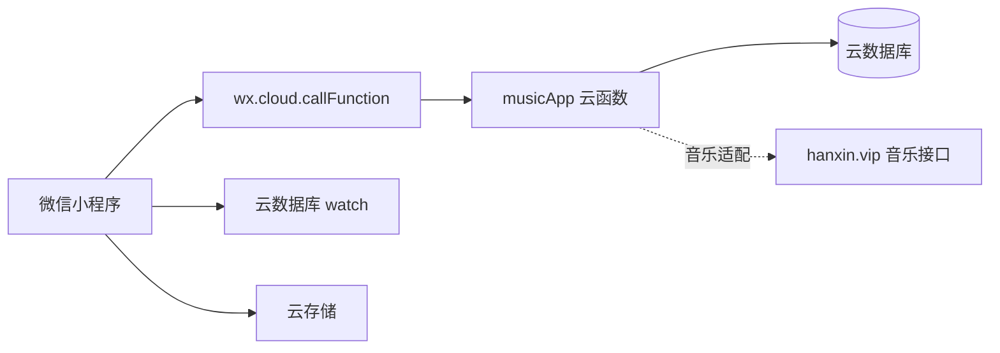

# 云开发迁移说明

## 迁移目标

项目已从独立 HTTP API、业务 `access_token` 和 WebSocket 架构迁移到微信云开发。当前业务固定使用一个默认房间，不再提供创建、搜索或切换房间功能。

## 当前架构



### 客户端

- `config/cloud.js` 统一保存云环境 ID 和云函数名称。
- `app.js` 和 `utils/request.js` 均显式绑定同一云环境，避免刷新后依赖调试器默认环境。
- `utils/request.js` 保留原页面调用形式，但内部统一转发到 `musicApp` 云函数。
- 首页使用云数据库 `watch` 监听 `messages` 和 `rooms` 集合。
- 聊天图片和用户主动选择的微信头像通过 `wx.cloud.uploadFile` 上传。
- 微信身份由云函数的 `cloud.getWXContext().OPENID` 识别，不再使用客户端 Token。

### 云函数

当前采用单入口路由云函数：

```text
cloudfunctions/musicApp
├── index.js
├── package.json
└── config.json
```

客户端传入原业务动作名，例如 `user/getmyinfo`、`message/send`、`song/addSong`。云函数在服务端获取 OPENID，并执行对应数据库操作。

## 数据库集合

| 集合 | 用途 | 关键字段 | 推荐索引 |
| --- | --- | --- | --- |
| `users` | 微信用户和资料 | `_openid`、`user_name`、`user_head`、`user_sex` | `_openid` 唯一 |
| `rooms` | 唯一默认房间和当前歌曲 | `room_id`、`room_name`、`room_user`、`current_song` | `room_id` 唯一 |
| `messages` | 文本、图片、语音和引用消息 | `room_id`、`payload`、`created_timestamp` | `room_id + created_timestamp` |
| `play_queue` | 待播放队列 | `room_id`、`song`、`sort_time` | `room_id + sort_time` |
| `playlists` | 用户歌曲收藏 | `_openid`、`mid`、`song` | `_openid + mid` 唯一 |

默认房间由首位完成手动登录的用户首次读取房间时自动创建：

```json
{
  "room_id": 1,
  "room_name": "Music For U"
}
```

首位成功创建用户的 `user_id` 会写入 `rooms.room_user`，作为唯一默认房主。后续用户不会覆盖房主。

## 登录流程

```text
用户点击首页登录入口
→ 在登录页主动选择微信头像并填写昵称、性别、签名
→ 头像上传云存储
→ 调用 musicApp / weapp/wxAppLogin
→ 云函数读取 OPENID 并校验资料
→ 创建或更新 users 文档
→ 返回业务用户资料
→ 首页刷新用户、默认房间和聊天状态
```

首页不会在首次启动时调用 `user/getmyinfo` 或自动创建用户。本地 `musicAppLoggedIn` 标记存在时才恢复既有用户；清除缓存后需要重新从登录页手动登录。微信头像和昵称必须由用户通过 `chooseAvatar`、`type="nickname"` 主动确认，后端不能根据 OPENID 静默获取。

OPENID 不返回客户端，也不作为客户端请求参数。

## 实时通信

首页不再连接 `wss://websocket.bbbug.com`，改为监听：

- `messages`：新增、撤回消息后刷新聊天记录。
- `rooms`：当前歌曲或房间状态变化后刷新播放器。

不再维护在线用户、最近活跃时间或在线人数。

应将数据库权限设置为客户端只读，写操作全部通过云函数完成。云函数使用服务端权限读写数据库。

## 文件存储

- 聊天图片路径：`messages/<时间戳>-<随机值>.jpg`
- 聊天语音路径：`messages/voice/<时间戳>-<随机值>.mp3`
- 用户头像路径：`avatars/<时间戳>-<随机值>.jpg`
- 数据库保存云文件 `fileID`。

## 音乐接口状态

计划接入的地址为：

```text
https://www.hanxin.vip/api/music
```

当前该地址在无文档的常见 GET、POST 参数测试中返回空响应，因此 `song/search` 暂时返回明确的适配器错误，不会伪造歌曲数据。完成接入还需要该接口的参数说明、鉴权方式和响应示例。云函数中的 `searchMusic` 是后续适配入口。

云数据库中的歌曲统一使用以下结构：

```json
{
  "mid": "歌曲唯一标识",
  "name": "歌曲名称",
  "singer": "歌手",
  "pic": "封面地址",
  "url": "合法可播放地址",
  "lrc": []
}
```

## 部署清单

1. 创建云开发环境，并确认 `config/cloud.js` 中的环境 ID 与目标环境一致。
2. 创建 `users`、`rooms`、`messages`、`play_queue`、`playlists` 五个集合。
3. 按上表创建索引。
4. 将集合客户端权限设为只读或禁止直接写入。
5. 部署 `musicApp` 云函数并安装云端依赖。
6. 确保云存储允许登录用户读取业务文件，上传由小程序云能力完成。
7. 从登录页选择头像并填写资料，调用 `weapp/wxAppLogin` 验证用户创建或更新。
8. 验证默认房间、消息发送、语音录制、引用回复、数据库监听和图片上传。
9. 获取音乐 API 文档后完成 `searchMusic` 适配并验证播放地址合法性。

## 已移除依赖

- `https://api.bbbug.com/api/`
- `https://bbbug.hamm.cn/`
- `wss://websocket.bbbug.com`
- 游客固定 Token
- 业务 `access_token`
- 账号密码登录
- 房间创建、搜索和切换入口
- 在线用户、在线人数和摸一摸功能
- 消息审核与举报流程
