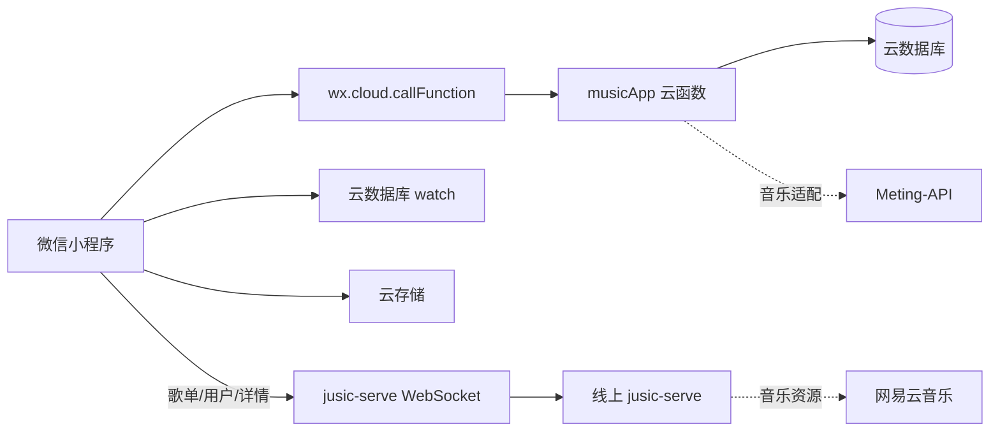

# 云开发说明

## 当前目标

项目使用微信云开发承载登录、聊天室、歌曲队列和文件存储；网易云歌单、用户和歌单歌曲详情使用独立的 jusic-serve WebSocket 通道。当前业务固定使用一个默认房间，不提供创建、搜索或切换房间功能。

## 当前架构



### 客户端

- `config/cloud.js` 统一保存云环境 ID 和云函数名称。
- `app.js` 和 `utils/request.js` 均显式绑定同一云环境，避免刷新后依赖调试器默认环境。
- `utils/request.js` 保留原页面调用形式，但内部统一转发到 `musicApp` 云函数。
- 首页使用云数据库 `watch` 监听 `messages` 和 `rooms` 集合。
- 聊天图片和用户主动选择的微信头像通过 `wx.cloud.uploadFile` 上传。
- 微信身份由云函数的 `cloud.getWXContext().OPENID` 识别，不再使用客户端 Token。

### 云函数

当前采用单入口路由云函数：

```text
cloudfunctions/musicApp
├── index.js
├── package.json
├── config.json
├── database.rules.json
└── database.indexes.json
```

客户端传入原业务动作名，例如 `user/getmyinfo`、`message/send`、`song/addSong`。云函数在服务端获取 OPENID，并执行对应数据库操作。

## 数据库集合

| 集合 | 用途 | 关键字段 | 推荐索引 |
| --- | --- | --- | --- |
| `users` | 微信用户和资料 | `_openid`、`user_name`、`user_head`、`user_sex` | `_openid` 唯一 |
| `rooms` | 唯一默认房间、当前歌曲和自动补歌状态 | `room_id`、`room_name`、`room_user`、`current_song`、`search_prompts`、`backup_songs`、`refill_lock_until`、`auto_refill_paused` | `room_id` 唯一 |
| `messages` | 文本、图片、语音和引用消息 | `room_id`、`payload`、`created_timestamp` | `room_id + created_timestamp` |
| `play_queue` | 待播放队列 | `room_id`、`song`、`sort_time`、`auto_added`、`backup_source` | `room_id + sort_time` |
| `playlists` | 用户歌曲收藏 | `_openid`、`source`、`mid`、`song` | `_openid + source + mid` 唯一 |

数据库规则和索引定义文件位于 `cloudfunctions/musicApp/database.rules.json` 和 `cloudfunctions/musicApp/database.indexes.json`，部署时需在云控制台手动创建对应集合与索引。

默认房间由首位创建业务账号的用户首次读取房间时自动创建：

```json
{
  "room_id": 1,
  "room_name": "Music For U"
}
```

首位成功创建用户的 `user_id` 会写入 `rooms.room_user`，作为唯一默认房主。后续用户不会覆盖房主。

## 登录流程

```text
用户进入首页
→ 静默调用 musicApp / user/getmyinfo
→ 云函数读取 OPENID 并查询 users
→ 已有用户直接返回资料并进入公共房间
→ 用户不存在时显示登录入口
→ 用户勾选协议同意（未勾选时点击登录触发抖动提示）
→ 可查看《用户服务协议》和《隐私政策》独立页面
→ 用户点击微信一键登录并在官方选择器确认头像
→ 头像上传云存储并调用 weapp/wxAppLogin 创建用户
→ 返回业务用户资料并刷新首页
```

首页每次启动都会静默调用 `user/getmyinfo`。云函数通过可信 OPENID 查询业务用户，因此已有用户即使清除本地缓存也能直接加载资料；查询不会自动创建用户。只有数据库中不存在该用户时才显示登录入口。

登录前必须显式勾选协议同意；协议与隐私政策以独立页面（`pages/user/agreement?type=service|privacy`）完整展示，不使用弹窗。微信头像必须由新用户通过 `chooseAvatar` 主动确认，后端不能根据 OPENID 静默获取；头像、OpenID 等信息收集均发生在用户授权之后。昵称、性别和签名可在登录后从资料页完善。项目不再使用本地业务登录标记，也不提供与微信身份冲突的业务退出登录。

OPENID 不返回客户端，也不作为客户端请求参数。

## 实时通信

实时状态来自云数据库监听：

- `messages`：新增、撤回消息后刷新聊天记录。
- `rooms`：当前歌曲或房间状态变化后刷新播放器。

不再维护在线用户、最近活跃时间或在线人数。

应将数据库权限设置为客户端只读，写操作全部通过云函数完成。云函数使用服务端权限读写数据库。

## 文件存储

- 聊天图片路径：`messages/<时间戳>-<随机值>.jpg`
- 聊天语音路径：`messages/voice/<时间戳>-<随机值>.mp3`
- 用户头像路径：`avatars/<时间戳>-<随机值>.jpg`
- 数据库保存云文件 `fileID`。

云存储权限必须设置为「所有用户可读，仅创建者可写」，否则其他用户无法读取头像、聊天图片和语音（表现为他人头像显示占位图）。客户端通过 `resolveMessageCloudUrls` 将消息中的 `cloud://` 地址转换为临时访问链接，图片消息使用 `img` 类型标识。

## 音乐接口状态

普通歌曲搜索、播放地址和歌词通过 `musicApp` 云函数访问 Meting-API，按平台路由：

```text
netease           → https://meting.mikus.ink/api
tencent / kugou / wydt → https://api.i-meto.com/meting/api
```

QQ 播放地址由云函数按 `songmid` 调用 `meting.mikus.ink` 的 `type=song` 详情接口动态解析，不持久化限时地址。当前未配置备用回退接口。

网易云歌单、用户、用户公开歌单和歌单歌曲详情由 `utils/jusicWsApi.js` 通过以下线上 WebSocket 通道访问，不经过云函数：

```text
wss://xin.hanxin.vip/server/{serverId}/{sessionId}/websocket
```

云函数还支持定时触发器 `refillPlaybackQueue`：周期性检查默认房间播放队列，不足时按「用户收藏 → 房间缓存 → 搜索提示词」顺序自动补歌。

详细请求 destination、握手顺序和返回字段见 [meting-api.md](./meting-api.md)。云函数仍负责把普通歌曲和播放资源转换为项目统一歌曲结构。

云数据库中的歌曲统一使用以下结构：

```json
{
  "mid": "歌曲唯一标识",
  "name": "歌曲名称",
  "singer": "歌手",
  "pic": "封面地址",
  "url": "合法可播放地址",
  "lrc": []
}
```

## 部署清单

1. 创建云开发环境，并确认 `config/cloud.js` 中的环境 ID 与目标环境一致。
2. 创建 `users`、`rooms`、`messages`、`play_queue`、`playlists` 五个集合。
3. 按上表创建索引（参考 `cloudfunctions/musicApp/database.indexes.json`）。
4. 将集合客户端权限设为只读或禁止直接写入（参考 `cloudfunctions/musicApp/database.rules.json`）。
5. 部署 `musicApp` 云函数并安装云端依赖，按需配置超时时间（云函数默认 3 秒上限，外部音乐接口调用可能超时）。
6. 按需为 `musicApp` 配置定时触发器 `refillPlaybackQueue` 以启用周期性自动补歌。
7. 将云存储权限设置为「所有用户可读，仅创建者可写」，确保跨用户头像、图片和语音可读。
8. 验证已有用户可静默进入；新用户须勾选协议同意并通过微信一键登录创建。
9. 验证默认房间、消息发送、语音录制、引用回复、数据库监听和图片上传。
10. 验证 Meting-API 搜索、播放地址、封面和歌词，并确认音频地址在真机可用。
11. 验证网易云歌单搜索、网易云用户搜索、用户公开歌单和歌单歌曲详情。
12. 在微信公众平台和开发者工具中配置 `https://xin.hanxin.vip` 为 request 合法域名、`wss://xin.hanxin.vip` 为 socket 合法域名；`urlCheck: false` 只放宽开发者工具校验，不能替代生产环境配置。确认该域名的 TLS 证书在目标微信版本和真机上有效。

## 当前边界

- `musicApp` 云函数负责登录、聊天室、歌曲队列、收藏、普通歌曲搜索、播放地址和歌词。
- `utils/jusicWsApi.js` 负责网易云歌单搜索、用户搜索、用户公开歌单和歌单歌曲详情。
- 小程序通过云数据库权限和云函数完成业务数据读写，客户端不直接写入业务集合。