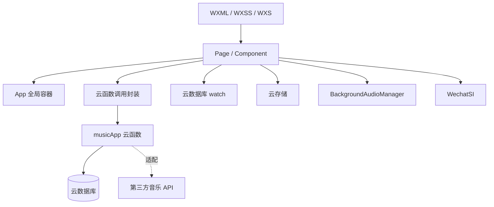
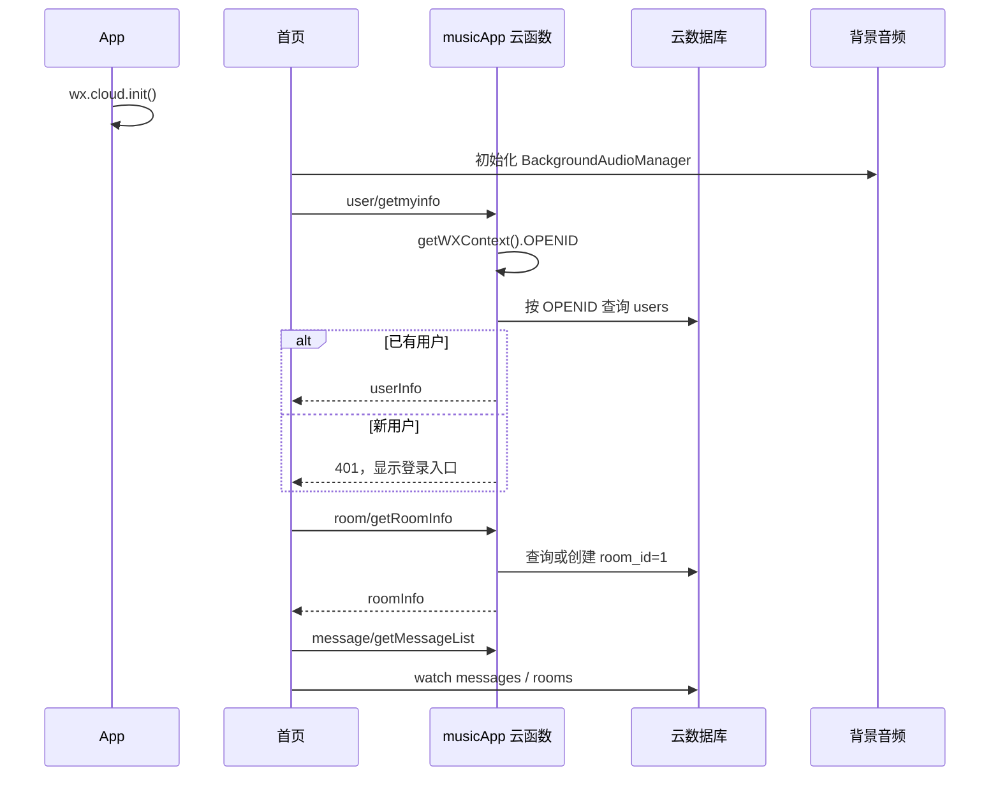
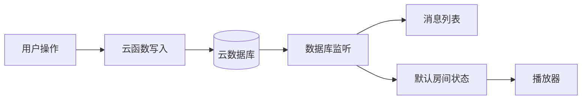

# 整体架构

## 逻辑分层



### 应用层

`app.js` 负责版本检查、系统信息、动态初始化 `wx.cloud`、共享用户与默认房间状态，以及暴露 `app.request`。

### 页面层

首页负责聊天、播放器和实时监听；歌曲页负责搜索、队列和歌曲收藏；用户页负责微信登录和资料。

### 云服务层

- `utils/request.js`：把原业务动作封装为 `wx.cloud.callFunction`。
- `cloudfunctions/musicApp/index.js`：服务端业务路由、身份识别、校验和数据库写入。
- 云数据库：持久化用户、默认房间、消息、队列和歌曲收藏。
- 云存储：保存用户头像、聊天图片和语音。

## 启动流程



## 实时架构



发消息时客户端先插入临时消息，云函数写入成功后 `messages.watch()` 返回正式数据并替换页面列表。切歌时云函数更新 `rooms.current_song`，`rooms.watch()` 驱动各客户端同步播放器。

## 状态管理

| 状态位置 | 内容 |
| --- | --- |
| `app.globalData` | `userInfo`、`roomInfo`、`atUserInfo`、`user_changed` |
| 首页 `data` | 消息、输入框、歌曲、歌词、播放器和监听器 |
| 云数据库 | 用户、默认房间、消息、队列、收藏 |

页面间使用 EventChannel 传递资料更新和驾驶模式操作结果。

## 关键数据流

### 微信身份

```text
首页静默调用 user/getmyinfo
→ 云函数读取 OPENID 并查询已有用户
→ 已有用户直接加载资料
→ 新用户显示登录入口
→ 选择头像后调用 weapp/wxAppLogin 创建用户
```

### 聊天发送

```text
输入消息
→ 本地 loading 消息
→ message/send 云函数
→ messages 集合新增
→ messages.watch
→ 正式消息列表
```

### 歌曲播放

```text
点歌或立即播放
→ play_queue 写入
→ rooms.current_song 更新
→ rooms.watch
→ playMusic
→ BackgroundAudioManager
```

### 自动补歌

```text
队列不足（目标 1~5 首，默认 3）
→ refill_lock_until 抢占 15 秒锁
→ 依次尝试：用户收藏 → rooms.backup_songs 缓存 → search_prompts 搜索
→ filterPlayableSongs 验证播放地址可解析
→ play_queue 写入（auto_added + backup_source 标记）
→ 队列排空时置 auto_refill_paused
```

触发途径包括切歌（`song/pass`、`song/ended`）、显式调用 `song/refill` 和定时触发器 `refillPlaybackQueue`。

## 设计约束

- 当前只有 `room_id = 1` 的默认房间。
- 首位创建默认房间的用户成为唯一房主；立即播放、置顶、清空消息和提示词管理仅限房主，移除队列歌曲限房主或点歌人，撤回消息限发送者或房主，切歌对所有登录用户开放。
- 客户端允许读取实时集合，但不能直接写数据库。
- OPENID 只在云函数中使用，不返回客户端。
- 普通歌曲接口依赖第三方 Meting-API（网易云走 `meting.mikus.ink`，QQ/酷狗/电台走 `api.i-meto.com`，无备用回退），网易云歌单和用户接口依赖线上 jusic-serve；当前请求参数、响应映射见 `docs/meting-api.md`，仍需关注上游服务变化。
- 子页面依赖首页已初始化 `app.globalData.userInfo` 和 `roomInfo`。
