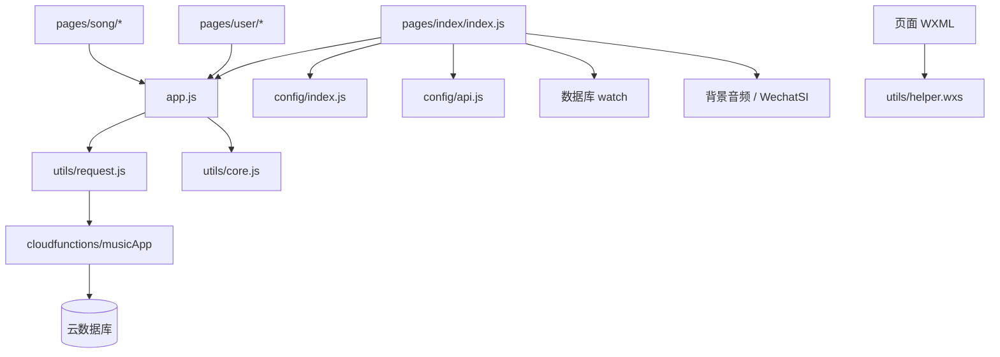
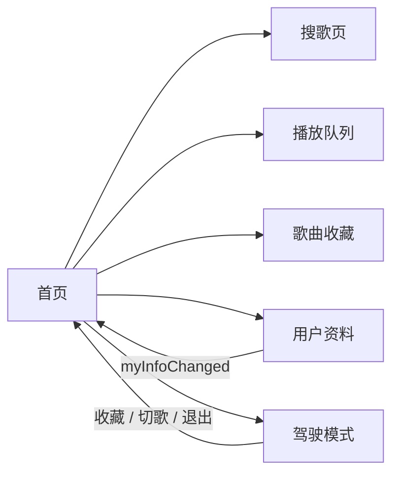

# 依赖关系

## 外部依赖

| 依赖 | 类型 | 用途 |
| --- | --- | --- |
| 微信小程序运行时 | 平台 | 页面、路由、音频、更新和云开发能力 |
| 微信云函数 | 服务端 | 身份识别、业务操作、校验和权限控制 |
| 微信云数据库 | 数据 | 用户、默认房间、消息、队列和收藏 |
| 微信云存储 | 文件 | 头像、聊天图片和语音 |
| WechatSI `0.3.4` | 插件 | 驾驶模式文本转语音 |
| `hanxin.vip` 音乐接口 | 待适配服务 | 歌曲搜索、播放地址和歌词 |

云函数目录包含独立 `package.json`，依赖 `wx-server-sdk`。客户端没有 npm 依赖，WeUI 和 iconfont 直接保存在仓库。

## 内部依赖

## 页面依赖

上述可达页面均已注册到 `app.json`。

## 数据依赖

- 首页和歌曲页依赖 `app.globalData.roomInfo`，其值固定指向默认房间。
- 所有云函数动作依赖可信 OPENID，但客户端不接触 OPENID。
- 实时消息依赖 `messages(room_id, created_timestamp)` 复合索引。
- 播放队列依赖 `play_queue(room_id, sort_time)` 复合索引。
- 收藏去重依赖 `playlists(_openid, mid)` 唯一索引。

## 配置依赖

- `project.config.json` 使用 `cloudfunctionRoot: cloudfunctions/`。
- `config/cloud.js` 统一配置显式云环境 ID和云函数名称。
- `database.rules.json` 定义登录用户只读、客户端禁止写入的权限策略。
- `database.indexes.json` 记录建议创建的数据库索引。

## 运行时版本

- `project.config.json` 基础库版本为 `2.19.2`。
- `project.private.config.json` 可能覆盖本地基础库版本。
- 云开发、数据库监听和后台音频均要求对应基础库能力可用。
